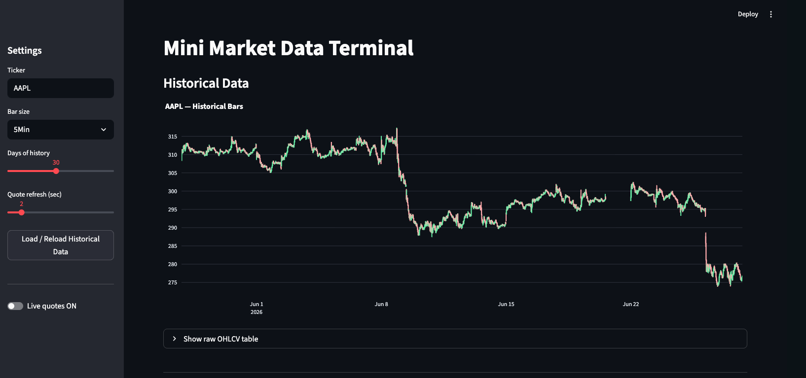
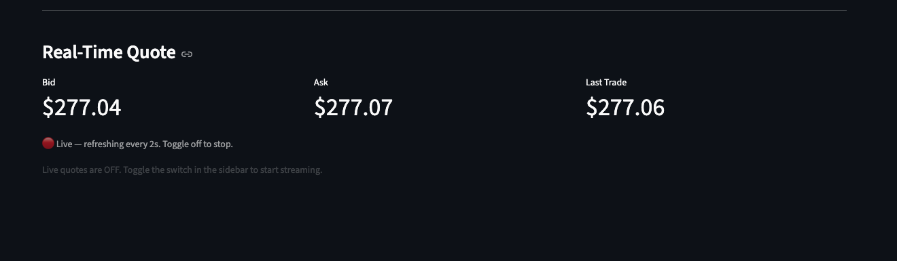
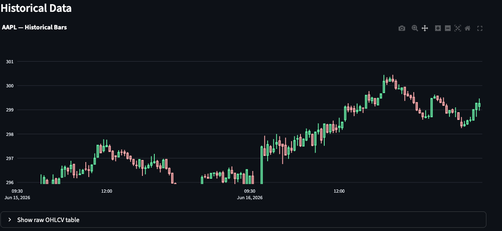
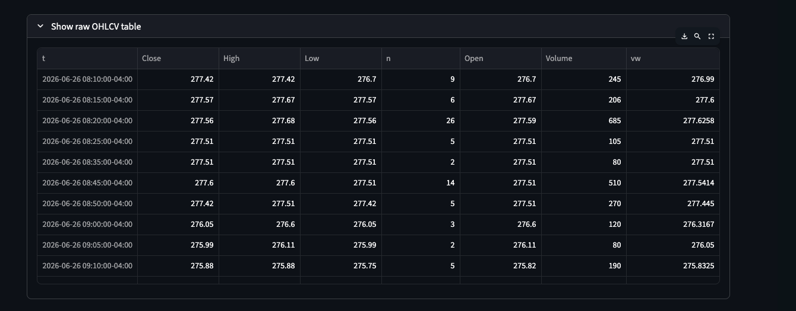

#FINM-25000-Homework-1


A small trading terminal built on Alpaca's Market Data API. It pulls historical OHLCV bars, polls live bid/ask quotes, and displays everything in a Streamlit UI. Built for FINM-25000 Homework 1.



## Setup

This project uses [Poetry](https://python-poetry.org/) for dependency management.

1. Clone the repo and install dependencies:

```
git clone https://github.com/awujira29/FINM-25000-Homework-1
cd FINM-25000-Homework-1
poetry install
```

2. Get your Alpaca paper keys. Log in at https://app.alpaca.markets, switch to a Paper account in the top-left, and generate an API key from the Home dashboard. Copy both the Key ID and the Secret (the secret is shown only once).

3. Create a `.env` file in the project root from the template:

```
cp .env.example .env
```

Then fill in your values:

```
ALPACA_API_KEY=your_key_id_here
ALPACA_SECRET_KEY=your_secret_key_here
```

Each teammate uses their own keys. The `.env` file is gitignored and should never be committed.

## Running it

```
poetry run streamlit run app.py
```

## Screenshots






